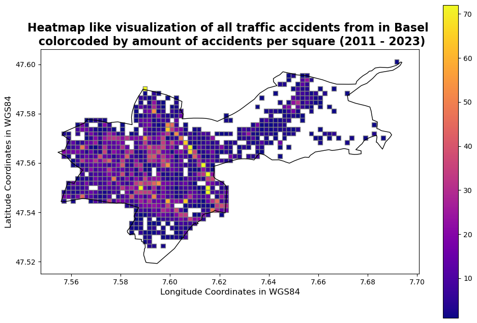
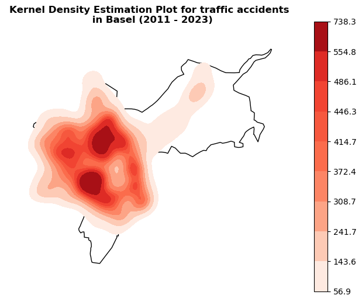
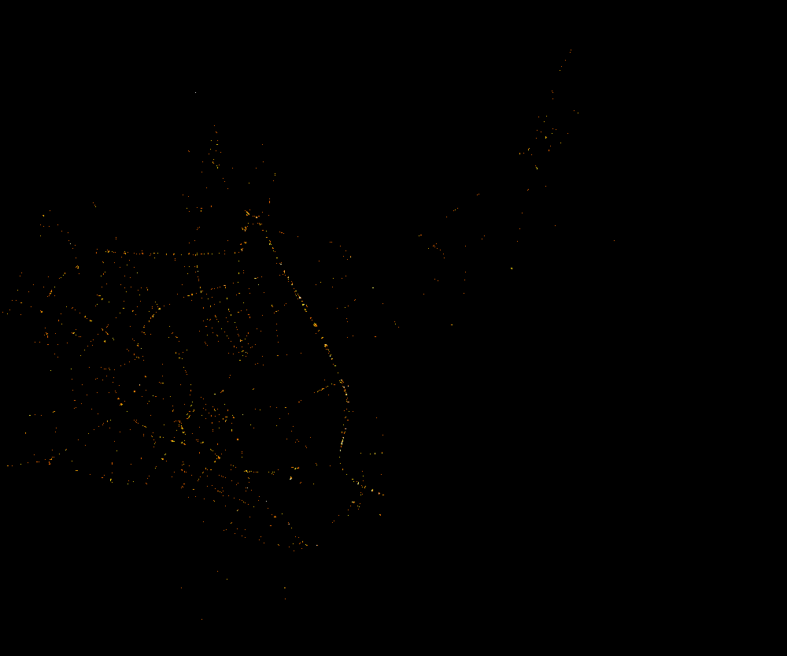
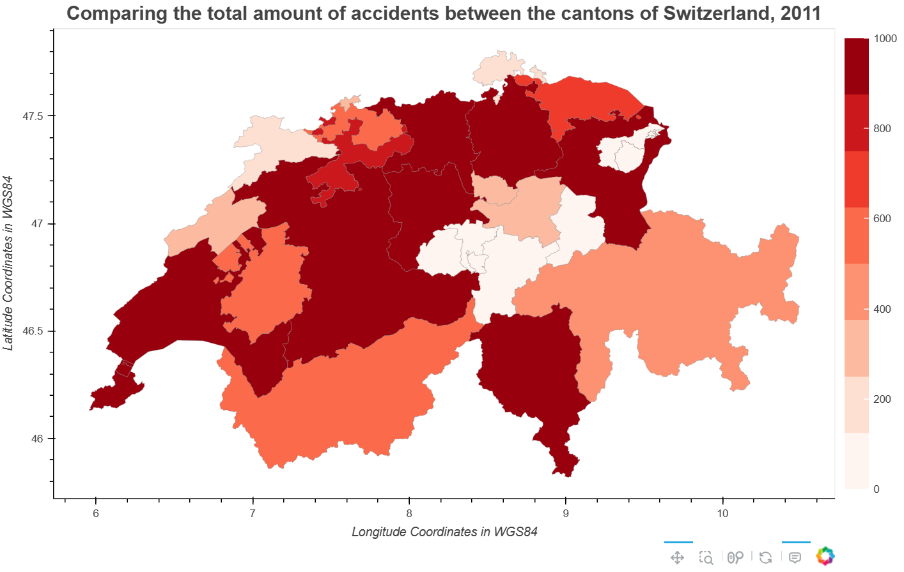

# Project: Visualization of the traffic situation in the “SmartCity” Basel

**Informations**  
Module: DVI - Data Viszalization 
Lecturer: Prof. Dr. Konrad Förstner, Muhammad Elhossary  
Participant: Andreas Kruff  
Matrikel-Nr: 11135772
  
```
Visualization of the traffic situation in the “SmartCity” Basel
```
**Keywords:** Data Visualization


## Description:

This repository was created as part of the examination of the module Data Visualization 2023 (Master Digital Science) and contains the used code, part of the used datasets and the project presentation and related images from this project.

#### Structure of this Repository
* `data\`: Datasets used for the visualizations
* `project_presentation\`: Powerpoint presentation regarding the project
* `scripts\`: Code implementation of the underlying visualizations
* `images\`: Exemplary images from the visualizations, that were made for the project

#### Notebook Description
| Filename                    | Description                                                                                                                                                         |
| --------------------------- | ------------------------------------------------------------------------------------------------------------------------------------------------------------------- |
| `` | |
| `` | |


## Impressions:

|  |  |
| -------------------- | -------------------- |
|  |  |

## References:

General Data Source Datenportal Basel:
https://data.bs.ch/explore/?sort=modified

Used datasets:
- [Road Traffic Accidents](https://data.bs.ch/explore/dataset/100120/table/?disjunctive.accidenttype_de&disjunctive.accidentseveritycategory_de&disjunctive.roadtype_de&disjunctive.accidentweekday_de&sort=accident_date)
- [Traffic Noise](https://data.bs.ch/explore/dataset/100087/table/?sort=timestamp) (not provided in the Repo, because of the size)
- [Boundaries of the Municipalities of Basel](https://data.bs.ch/explore/dataset/100017/table/)

General Data Source GEO.ADMIN.CH:
https://data.geo.admin.ch/

Used datasets:
- [All accidents with personal injury (Switzerland)](https://data.geo.admin.ch/ch.astra.unfaelle-personenschaeden_alle/)

General Datasource swisstopo:
https://www.swisstopo.admin.ch/de/geodata/landscape/boundaries3d.html

- [Download Link to the latest boundary map of switzerland](https://data.geo.admin.ch/ch.swisstopo.swissboundaries3d/swissboundaries3d_2023-01/swissboundaries3d_2023-01_2056_5728.shp.zip)
 